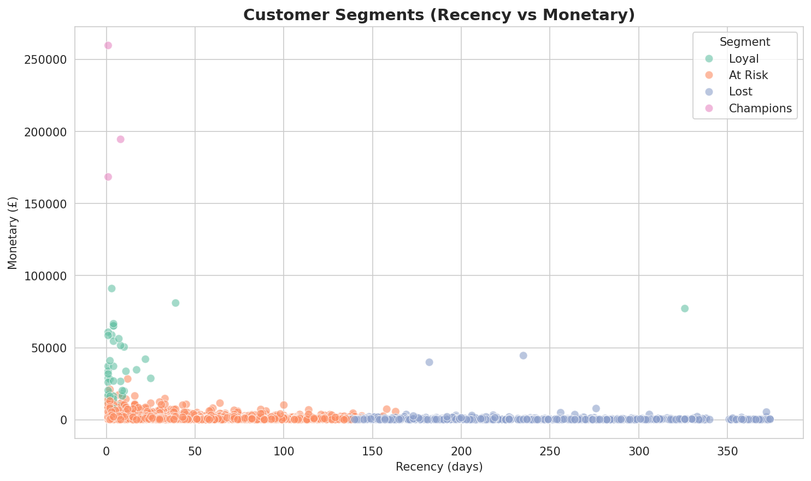
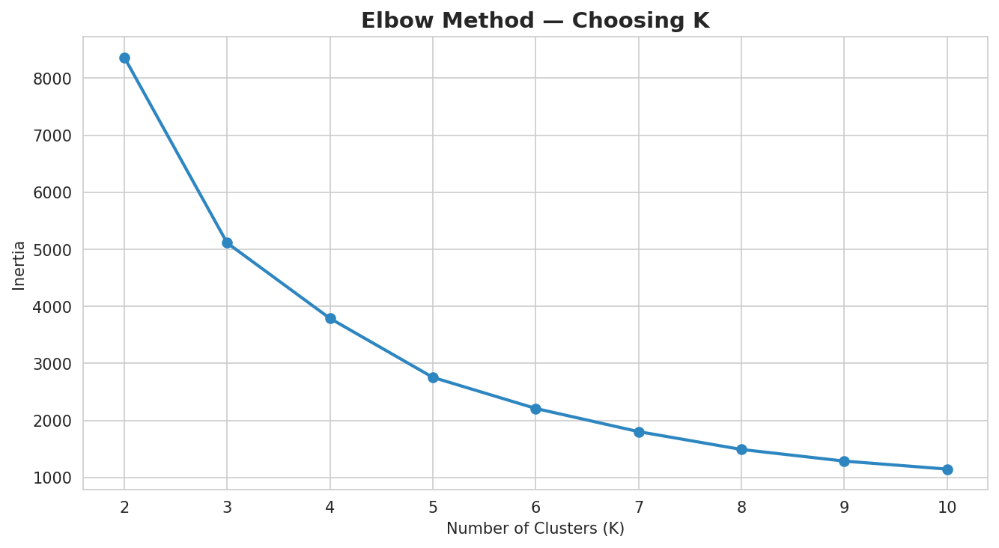
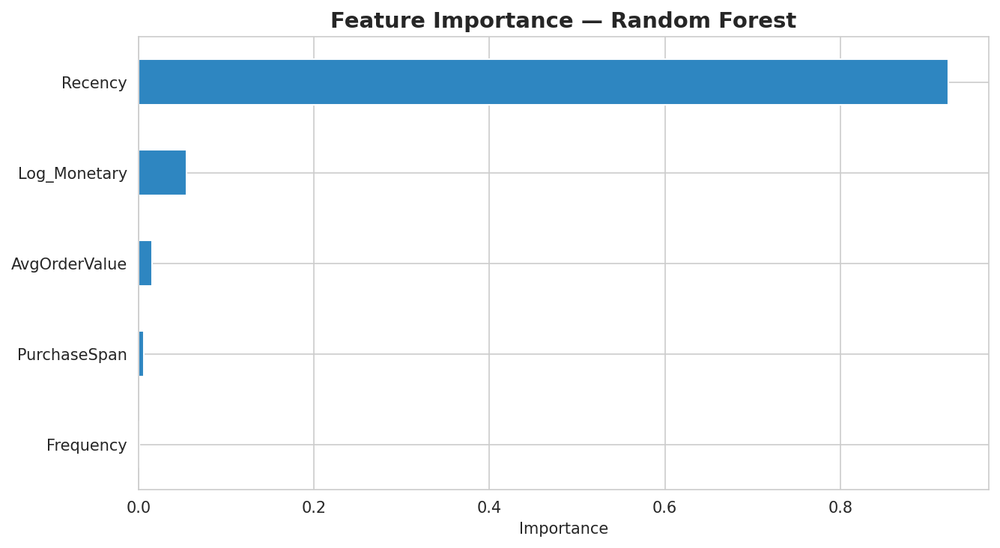
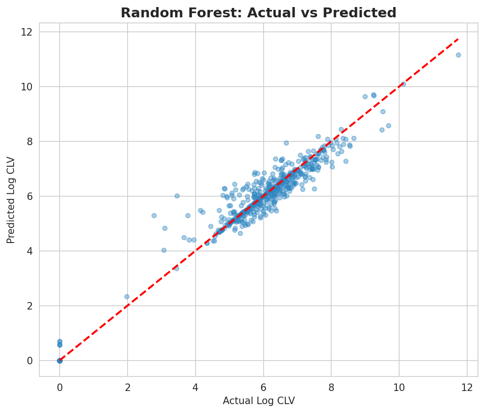

# 💰 Customer Lifetime Value Predictor

> Predicting which customers will generate the most revenue in the next 90 days — enabling smarter retention budget allocation.

🔗 **Live Demo:** https://unplugged14-clv-predictor.hf.space

## 🎯 Business Problem

E-commerce businesses lose money by treating every customer equally. This project predicts each customer's 90-day revenue and segments them into actionable value tiers — so the business knows exactly where to focus retention spend.

## 📊 Dataset

- **Source:** UCI Online Retail Dataset — [Kaggle](https://www.kaggle.com/datasets/carrie1/ecommerce-data)
- **Size:** 541,909 transactions → cleaned to ~400K UK-only purchases, ~3,900 unique customers
- **Target:** CLV_90days — total customer spend in the most recent 90-day window

## 🔧 Approach

| Step | Details |
|---|---|
| Data Cleaning | Removed cancellations, nulls, non-UK transactions |
| Feature Engineering | RFM (Recency, Frequency, Monetary) + AvgOrderValue + PurchaseSpan |
| Transformation | Log transform on skewed Monetary and CLV target |
| Modelling | Compared Linear Regression, Random Forest, XGBoost |
| Segmentation | K-Means clustering (Elbow Method, K=4) |
| Deployment | Streamlit app on Hugging Face Spaces |

## 📈 Results

| Model | MAE | RMSE | R² |
|---|---|---|---|
| Linear Regression | 1.1279 | 1.5336 | 0.7507 |
| XGBoost | 0.2233 | 0.5286 | 0.9704 |
| **Random Forest (Best)** | **0.1858** | **0.3584** | **0.9864** |

## 💡 Key Business Insights

- Revenue is concentrated in a small customer base — top 10 customers drive a disproportionate share of total revenue
- "Champions" segment (low recency, high frequency, high spend) should receive the highest retention investment
- "At Risk" customers need fast intervention — a 7-day win-back window is far more effective than generic monthly campaigns
- "Lost" customers show minimal ROI potential — budget is better spent acquiring new customers
- Purchase frequency is a stronger predictor of future value than one-off high spend

## 📊 Visualisations

### Customer Segments


### Elbow Method


### Feature Importance


### Actual vs Predicted


## 🛠️ Tech Stack

Python · Pandas · NumPy · Scikit-learn · XGBoost · K-Means · Streamlit · Hugging Face Spaces

## 🚀 How to Run Locally

```bash
git clone https://github.com/Unplugged14/clv-predictor.git
cd clv-predictor
pip install -r requirements.txt
streamlit run app.py
```

## 📁 Repository Structure
clv-predictor/

├── CLV_Predictor_Final.ipynb   # Main analysis notebook

├── app.py                       # Streamlit app

├── clv_model.pkl                 # Trained RandomForest model

├── *.png                         # Visualisations

└── README.md

## 📝 Limitations and Next Steps

- CLV_90days is defined using only the available transaction window — a longer historical dataset would allow more robust validation
- Model does not account for product category preferences or seasonality
- A/B testing recommended interventions would validate whether predicted segments translate into actual retention improvements
